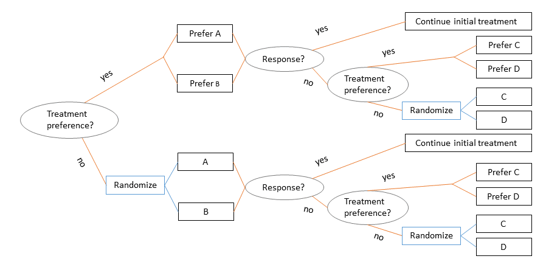
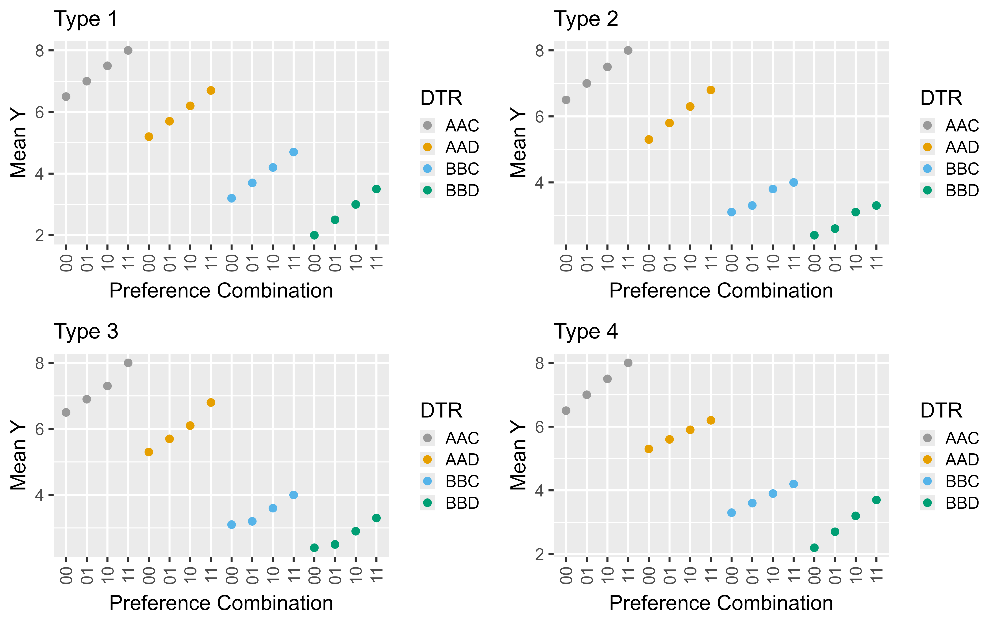

# PRPP_SMART_WRRM_continuous
Data generation and frequentist analytic methods for a Partially Randomized, Patient Preference, Sequential, Multiple Assignment, Randomized Trial (PRPP-SMART) with a continuous end-of-trial outcome. 
Companion to the manuscript "Design and Analysis of SMARTs with Treatment Preference, with Application to the STAR*D Trial" by Sarah Medley, Marianthe Wank, Thomas M. Braun, and Kelley M. Kidwell submitted to X.

## The PRPP-SMART Design
Our PRPP-SMART design assumes there are two stages with two treatment options per stage. At the beginning of stage 1, participants are asked if they have a preference between the two stage 1 treament options (A, B). All participants with a preference are assigned to their preferred treatment while all others are randomized to one of the two treatment options. At the end of stage 1, response status is determined (i.e., responder or non-responder). Responders continue their stage 1 treatment in stage 2 while non-responders are re-assigned to two new treatment options that may be more effective (C, D). Treatment preference is elicited from non-responders at the beginning of stage 2, and non-responders with a preference receive their preferred treatment while all other non-responders are randomized. 



## PRPP-SMART Notation and Goal
Notation:
- A<sub>1</sub> = {A, B} and A<sub>2</sub> = {C, D} denote stage 1 and 2 treatment, respectively
- T<sub>1</sub> and T<sub>2</sub> are binary indicators of stage 1 and 2 treatment, respectively with T<sub>1</sub> = 1 for A and 0 for B, T<sub>2</sub> = 1 for C and 0 for D
- P<sub>1</sub> and P<sub>2</sub> are binary indicators of stage 1 and 2 preference, respectively

Our goal is to estimate dynamic treatment regimens (DTRs) subject to treatment preference. We denote DTRs by [A<sub>1</sub>A<sub>1</sub>A<sub>2</sub>]<sub>P<sub>1</sub>P<sub>2</sub></sub>, and there are 16 DTRs embedded in our PRPP-SMART design (i.e., the 4 traditional DTRs AAC, AAD, BBC, and BBD but within each preference combination). In particular, we aim to estimate the four indifference DTRs [AAC]<sub>00</sub>, [AAD]<sub>00</sub>, [BBC]<sub>00</sub>, and [BBD]<sub>00</sub> with minimal bias while utilizing all data from a PRPP-SMART. Since the use of non-randomized data makes bias a primary concern, we evaluate our method in a variety of scenarios. 

## Data Generation
PRPP_SMART_DataGen_cts.R contains R code to generate data consistent with our PRPP-SMART design with a continuous end-of-trial outcome. The data generation procedure was adapted from Wang et al. (2022) by co-author Mari Wank for PRPP-SMARTs with a binary end-of-trial outcome (see https://github.com/mariwank/PRPP-SMART). The outcome generation was modified for continuous outcomes, but the rest of the data generation procedure remains the same. 

## Data Generation Scenarios
- Preference rate scenarios: add description. Generated by scenario_a.R, scenario_b.R, scenario_c.R files in the Scenarios folder.
- Types of preference augmented DTR effects: traditional DTR effects measure the expected differences between AAC, AAD, BBC, and BBD while preference augmented DTR effects measure the expected differences within a DTR based on preference (e.g., the differences between [AAC]<sub>00</sub>, [AAC]<sub>01</sub>, [AAC]<sub>10</sub>, [AAC]<sub>11</sub>). We explore 4 types of preference augmented DTR effects illustrated below.



- Preference augmented DTR effect sizes: we consider three preference augmented DTR effect size scenarios based on the size of the effect between [A<sub>1</sub>A<sub>1</sub>A<sub>2</sub>]<sub>00</sub> and [A<sub>1</sub>A<sub>1</sub>A<sub>2</sub>]<sub>11</sub>. We explore small (&delta; = 0.1), moderate (&delta; = 0.25), and large (&delta;=0.5) effects.
- Preference augmented DTR effects of type *X* and size *Y* are generated by type*X*_*Y*.R files in the Scenarios folder.
- We fix intermediate response rates, preference rates for A vs. B, and preference rates for C vs. D 

## Analytic Methods
We extend frequentist weighted and replicated regression models (WRRMs) for traditional SMARTs to PRPP-SMARTs. We consider a reduced mean model (Model 1) and a more flexible mean model (Model 2). Let &mu;<sub>A<sub>1</sub>A<sub>2</sub></sub><sup>P<sub>1</sub>P<sub>2</sub></sup> = E[[A<sub>1</sub>A<sub>1</sub>A<sub>2</sub>]<sub>P<sub>1</sub>P<sub>2</sub></sub> | T<sub>1</sub>, P<sub>1</sub>, T<sub>2</sub>, P<sub>2</sub>]. Then, the models are expressed as

Model 1: &mu;<sub>A<sub>1</sub>A<sub>2</sub></sub><sup>P<sub>1</sub>P<sub>2</sub></sup> = &alpha;<sub>1</sub> + &beta;<sub>1</sub>*T<sub>1</sub> + &theta;<sub>1</sub>*T<sub>2</sub> + &gamma;<sub>1</sub>*T<sub>1</sub>*T<sub>2</sub> + &delta;<sub>1</sub>*T<sub>1</sub> + &delta;<sub>2</sub>*T<sub>1</sub>

Model 2: &mu;<sub>A<sub>1</sub>A<sub>2</sub></sub><sup>P<sub>1</sub>P<sub>2</sub></sup> = &alpha;<sub>2</sub> + &beta;<sub>2</sub>*T<sub>1</sub> + &theta;<sub>2</sub>*T<sub>2</sub> + &gamma;<sub>2</sub>*T<sub>1</sub>*T<sub>2</sub> + &omega;<sub>B</sub>*T<sub>1</sub> + &omega;<sub>A</sub>*T<sub>1</sub>*P<sub>1</sub> + &omega;<sub>D</sub>*T<sub>2</sub> + &omega;<sub>C</sub>*T<sub>2</sub>*P<sub>2</sub> + &phi;P<sub>1</sub>P<sub>2</sub>

We compare both models to a traditional analysis of treatment indifferent participants only, which provides unbiased estimates of the indifference DTR effects based on results for traditional SMARTs.

Traditional Analysis: E[[A<sub>1</sub>A<sub>1</sub>A<sub>2</sub>]<sub>00</sub> | T<sub>1</sub>, T<sub>2</sub>] = &alpha;<sub>3</sub> + &beta;<sub>3</sub>*T<sub>1</sub> + &theta;<sub>3</sub>*T<sub>2</sub> + &gamma;<sub>3</sub>*T<sub>1</sub>*T<sub>2</sub>

All three analytic methods are implemented in PRPP_SMART_WRRM_cts.R. 

Input:
- Home Directory: set directory for file input by setting ```homedir```. All relevant files (data generation code, scenario .R files, etc.) must be in the same directory.
- Output Directory: set directory for file output by setting ```outdir```. By default, this variable is set to ```homedir``` so that the input and output file directory are the same.
- PRPP-SMART Sample Size: change the total trial size by setting ```N``` to an integer value.
- Preference Rate Scenario: change the preference rate scenario by setting ```scenario``` = a, b, or c.
- Preference Augmented DTR Effect Type: change the effect type by setting ```type``` = 1, 2, 3, or 4.
- Preference Augmented DTR Effect Size: change the effect size by setting ```size``` = small, moderate, or large.
- Data Variability: change the data variability at the trial pathway level by setting ```sigma2``` to a value greater than 0.
- Other options fixed in the scenarios we consider such as intermediate response rates can also be changed. There is a description of input variables in the PRPP_SMART_DataGen_cts.R. 

Output:


  
change R file so that it does analysis with all 3 models!

add code to calculate expected sample size
